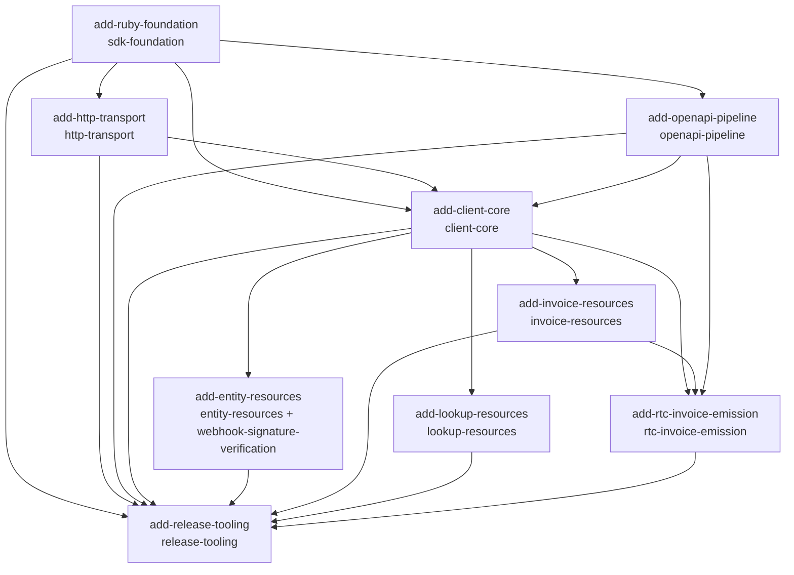

# Visão geral do changeset — SDK Ruby NFE.io v1

## Introdução

O SDK Ruby da NFE.io (gem `nfe-io`) está passando por uma **reescrita greenfield v1** (bump `0.3.2 → 1.0.0`). A v0.3.2 — baseada em `rest-client`, escrita para Ruby 2.4 e anos sem manutenção — é congelada num snapshot na branch `0.x-legacy` (quem precisar fixa `gem "nfe-io", "~> 0.3"`); a v1 nasce limpa em `master`, sem reaproveitar nada do código legado.

Princípios da v1:

- **Greenfield**: `lib/nfe/` nasce vazio; quebra total de compatibilidade documentada em `MIGRATION.md`.
- **Zero dependências de runtime**: apenas stdlib (`net/http`, `json`, `openssl`, `uri`, `securerandom`, `stringio`, `time`, `base64`). As deps de dev (RSpec, RuboCop, RBS, Steep, SimpleCov) e de codegen nunca entram no pacote publicado.
- **Paridade-plus com Node/PHP**: mesma superfície de 17 recursos dos SDKs de referência (`nfe-io` Node, `nfe/client-php`), com extensões (emissão de NFC-e, upload de certificado) e ergonomia estilo Stripe (`Nfe::Client.new(api_key:)` + acessores de recurso lazy `snake_case`), mas em Ruby idiomático (`Data.define`, keyword args, retorno síncrono, erros tipados via `raise`).
- **Rigor de tipos**: assinaturas RBS em `sig/`, type-check com Steep, lint com RuboCop, cobertura SimpleCov ≥ 80%, CI matrix Ruby 3.2/3.3/3.4.
- **Modelos gerados de OpenAPI**: DTOs `Data.define` imutáveis gerados a partir dos specs sincronizados do `nfeio-docs` (fonte da verdade), separados da camada de DX feita à mão.

A v1 é entregue em **9 changes** que formam um grafo de dependências: uma fundação, três camadas de infraestrutura, um núcleo de DX, quatro famílias de recurso e um fechamento de release.

## Tabela de changes

| Change | Capabilities (novas) | Depende de | Escopo (uma linha) |
|---|---|---|---|
| `add-ruby-foundation` | `sdk-foundation` | — (foundational) | Gem `nfe-io` 1.0.0, namespace `Nfe`, piso Ruby 3.2, zero-dep de runtime, RBS/Steep/RuboCop/RSpec e CI matrix 3.2/3.3/3.4. |
| `add-http-transport` | `http-transport` | `add-ruby-foundation` | Camada HTTP zero-dep sobre `Net::HTTP`: request/response, retry com backoff+jitter, multi-base-URL, erros tipados + `ErrorFactory`, logger com redação. |
| `add-openapi-pipeline` | `openapi-pipeline` | `add-ruby-foundation` | Codegen Ruby (stdlib+dev-only) que lê specs OpenAPI sincronizados do `nfeio-docs` e emite `Data.define` + `.rbs`, com banner anti-edição e guarda de sincronia em CI. |
| `add-client-core` | `client-core` | `add-ruby-foundation`, `add-http-transport`, `add-openapi-pipeline` | Núcleo de DX: `Nfe::Client`, `Configuration` + host map fonte-única, `AbstractResource`, contrato 202 (`Pending`/`Issued`), `FlowStatus`, `IdValidator`, paginação e os 17 acessores lazy stub. |
| `add-entity-resources` | `entity-resources`, `webhook-signature-verification` | `add-client-core` | 4 recursos de entidade no host `api.nfe.io` — companies (+ upload de certificado PKCS#12), legal_people, natural_people, webhooks — mais verificação HMAC-SHA1 (`X-Hub-Signature`). |
| `add-invoice-resources` | `invoice-resources` | `add-client-core` | 5 recursos de invoice — service (NFS-e), product (NF-e), consumer (NFC-e, paridade-plus), transportation (CT-e inbound), inbound-product — exercitando o contrato 202 e o multi-host. |
| `add-lookup-resources` | `lookup-resources` | `add-client-core` | 8 recursos de lookup/consulta/dados auxiliares — addresses, legal_entity_lookup, natural_person_lookup, product/consumer_invoice_query, tax_calculation, tax_codes, state_taxes — principal exercitador do host map. |
| `add-rtc-invoice-emission` | `rtc-invoice-emission` | `add-client-core`, `add-invoice-resources`, `add-openapi-pipeline` | Recursos aditivos opt-in para emissão no layout RTC: `service_invoices_rtc` (NFS-e, grupo `ibsCbs` IBS/CBS, + XML do evento de cancelamento no Ambiente Nacional) e `product_invoices_rtc` (NF-e modelo 55 + NFC-e modelo 65, grupos item-level `IBSCBS` IBS estadual/municipal + CBS + `IS`/Imposto Seletivo). |
| `add-release-tooling` | `release-tooling` | todas as 8 anteriores | Fecha a v1.0.0: gemspec moderno, versão fonte-única, CHANGELOG/MIGRATION/README/CONTRIBUTING (pt-BR), samples, workflow de release (CI gate + RubyGems OIDC) e skill de IA `nfeio-ruby-sdk`. |

Notas:

- `add-entity-resources`, `add-invoice-resources` e `add-lookup-resources` dependem **só** de `add-client-core` e não compartilham arquivos entre si — podem ser implementadas em paralelo.
- `add-rtc-invoice-emission` é puramente aditiva: não modifica `invoice-resources`; os recursos clássicos `service_invoices` e `product_invoices` permanecem intactos (RTC entra como recursos novos `service_invoices_rtc` e `product_invoices_rtc`).
- Nenhuma change modifica a spec de outra (`Modified Capabilities` é sempre vazio) — o repositório ainda não tinha specs versionadas em `openspec/specs/`. Cada change apenas **adiciona** capability(ies) e **consome** as anteriores.

## Ordem recomendada de implementação

Respeitando o grafo de dependências (topological order):

1. **`add-ruby-foundation`** — fundação obrigatória; nada de runtime sozinha, mas viabiliza tudo.
2. **`add-http-transport`** e **`add-openapi-pipeline`** — independentes entre si; ambas só dependem da fundação. Podem ser feitas em paralelo.
3. **`add-client-core`** — exige fundação + transport + pipeline. É o ponto de convergência; entrega os 17 acessores stub e os contratos compartilhados.
4. **`add-entity-resources`**, **`add-invoice-resources`** e **`add-lookup-resources`** — dependem só do core; sem sobreposição de arquivos; **paralelizáveis**.
5. **`add-rtc-invoice-emission`** — depois de `add-invoice-resources` (reusa as superfícies clássicas de service- e product-invoice como padrão) e do pipeline (gera os DTOs RTC de NFS-e e de NF-e/NFC-e).
6. **`add-release-tooling`** — por último; exige todas as changes irmãs aplicadas e estáveis. Política conservadora: ao menos um `v1.0.0-rc.1` + período de beta antes do GA (toca emissão fiscal).

## Não-objetivos conscientes (v1)

Lacunas de paridade deliberadamente adiadas, registradas como não-objetivos conhecidos da v1 (todas consistentes com os SDKs Node e PHP, que também não as cobrem):

- **Inscrições municipais** — sem `municipal_taxes` (análogo a `state_taxes`); fora de escopo na v1.
- **Listagem inbound via OData** — sem query OData para os recursos inbound; apenas as operações já cobertas.
- **Variantes SERPRO** — sem os endpoints/fluxos específicos da SERPRO.
- **`switch-authorizer` e certs v2** — sem troca de autorizador nem a API v2 de certificados.
- **Autenticação JWT Bearer** — apenas API key (`Authorization`/header de chave); sem fluxo JWT Bearer.
- **`retrieve_by_external_id`** — sem busca por id externo; recuperação só pelo id NFE.io.

Uma **revisão multi-perspectiva** do changeset foi executada; o relatório vive em `openspec/REVIEW-v1-changeset.md`. A partir dessa revisão, `idempotency_key`, thread-safety (mutex), `request_options` (por chamada) e configuração via variáveis de ambiente foram trazidos ao escopo do v1.

## Grafo de dependências (Mermaid)

